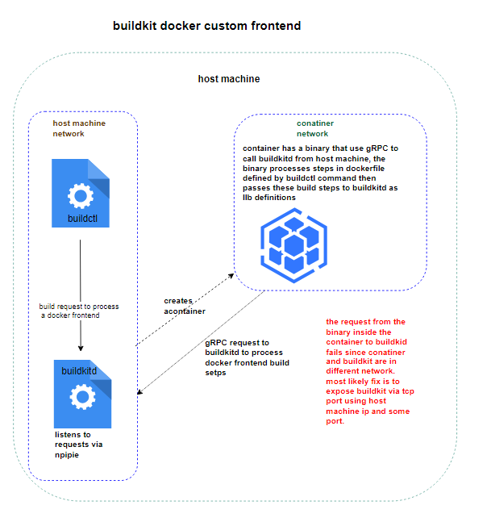

# Custom Frontends in BuildKit

Custom frontends in BuildKit are OCI images that contain executables responsible for interpreting build definitions like Dockerfiles. When a build is triggered with a custom frontend (typically specified using the `#syntax=` directive), BuildKit creates a container from the frontend image and runs the executable inside it. This executable communicates with BuildKitd over gRPC, processing the build input and generating a Low-Level Build (LLB) definition, which it sends back to BuildKitd to execute the actual build steps. In this way, the frontend container acts as a dynamic translator between the user's build instructions and the internal build graph, enabling custom logic, preprocessing, or entirely new build syntaxes.

use case



## Section One: Custom Frontend Preparation

I have this [sample code](https://github.com/billywr/test-go-custom-frontend/blob/master/main.go) that I used to generate an `.exe` file, which is required to create a custom frontend image.

For testing purposes, you can clone the repository:

```
git clone https://github.com/billywr/test-go-custom-frontend
cd test-go-custom-frontend
```

Navigate to the main repository and run the following command to build an `.exe` file:

`GOOS=windows GOARCH=amd64 CGO_ENABLED=0 go build -o wcow-frontend.exe`

## Creating the Dockerfile
Create a `Dockerfile` where the generated `wcow-frontend.exe` will be used to create the custom image. Ensure that both the `Dockerfile` and `wcow-frontend.exe` are in the same directory.

Here are the contents of the `Dockerfile:`

```aiignore
FROM mcr.microsoft.com/windows/nanoserver:ltsc2022
USER ContainerAdministrator
COPY wcow-frontend.exe /wcow-frontend.exe
ENTRYPOINT ["/wcow-frontend.exe"]
```

## Building and Pushing the Image (creates custom docker frontend image)
Use the following `buildctl` command to build an image from the Dockerfile and push it to a Docker registry:

```aiignore
buildctl build `
    --frontend=dockerfile.v0 `
    --local context="buildContextPath" `
    --local dockerfile="PathToDockerfile" `
    --output type=image,name=docker.io/username/imageName:latest,push=true

```

At this point, you should have your custom frontend Docker image `imageName:latest` available in the Docker registry.

# Section Two: Running the Custom Frontend
You can accomplish this using either buildctl or Docker CLI.

## Prerequisites
The BuildKit daemon should be running in a way that allows containers on its host machine to access it. This is because the custom frontend, running inside a container, must send requests to the BuildKit daemon via gRPC.

A possible way to ensure this works is by stopping any running BuildKit instance and exposing `buildkitd` via the host machine's IP address using the following command:

`start-process buildkitd -ArgumentList "--addr", "tcp://<host_machine_IP>:1234"`

Verify that BuildKit has started with the correct IP configuration and is listening for requests on the specified port:
`netstat -an | findstr 1234`

## Running the Custom Frontend
Once everything is set up, you can run the following command:

create dockerfile input, since our frontend expects a dockerfile, notice the use of `#syntax` this enables buidlkit to process the image as a custom frontend.
```aiignore
#syntax=docker.io/username/imageName:latest
FROM mcr.microsoft.com/windows/nanoserver:ltsc2022
```


use this command to build the dockerfile input.
```aiignore
buildctl build `
  --frontend=dockerfile.v0 `
  --local context="pathToBuildContext" `
  --local dockerfile="pathToDockerfileInput" `
  --output type=image,name=docker.io/username/resultingImageName:latest,push=false
```

This build process creates a container with the executable `wcow-frontend.exe`, the executable using gRPC send LLB build definitions to buildkitd.

# Note:
**Section Two** is still under testing; therefore, this document will be updated in due course.

You are welcome to give your feedback and suggestions.